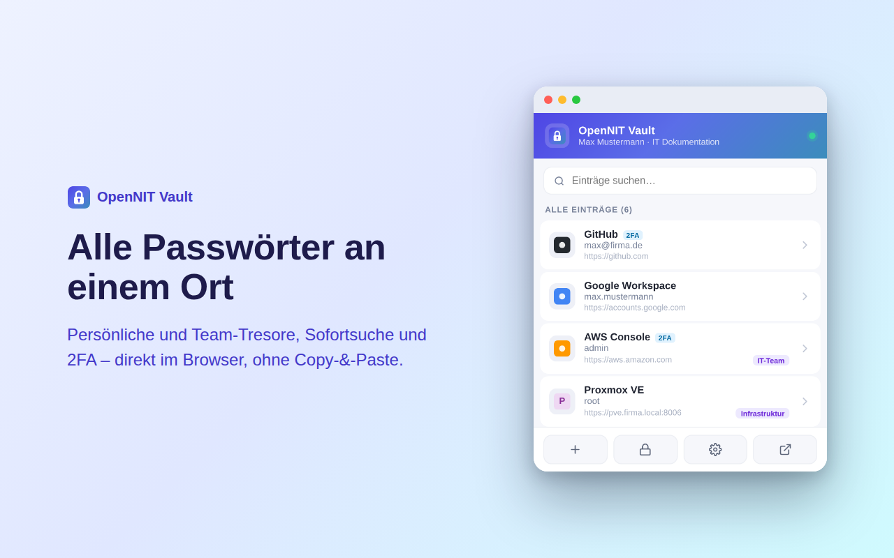
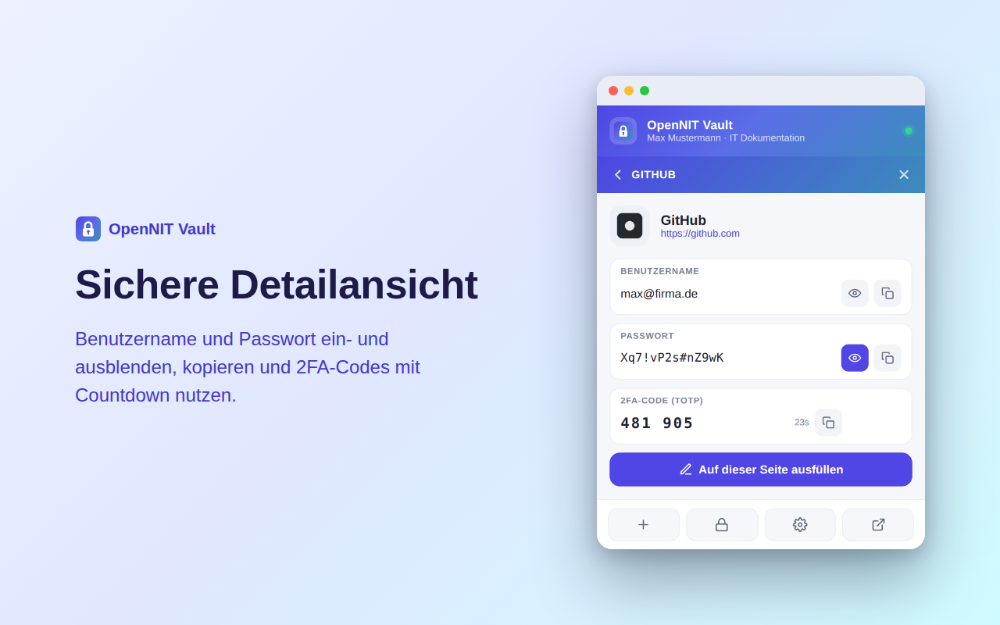

<p align="center">
  
</p>

<h1 align="center">OpenNIT Vault – Browser-Erweiterung</h1>

<p align="center">
  Passwort-Manager-Erweiterung für <a href="https://github.com/friloo/OpenNIT">OpenNIT</a> –
  Autofill für Benutzer-, Passwort- und 2FA-Felder direkt im Browser.
</p>

---

## Was ist das?

**OpenNIT Vault** ist die Browser-Erweiterung zum Passwort-Tresor von OpenNIT. Sie verbindet sich mit
deiner selbst gehosteten OpenNIT-Instanz und bietet:

- 🔎 **Sofortsuche** über alle persönlichen und Team-Tresore
- ⌨️ **Autofill** von Benutzername, Passwort und **2FA/TOTP-Codes** – auch auf mehrstufigen Login-Seiten
- 💡 **Vorschläge direkt im Eingabefeld** (passend zur aufgerufenen Website)
- 👁️ **Detailansicht** mit Anzeigen/Kopieren von Zugangsdaten und 2FA-Code mit Countdown
- ➕ **Neue Einträge anlegen** inkl. **Passwort-Generator**
- 🔒 **PIN-Sperre** mit demselben PIN wie der Web-Tresor (Dauer frei wählbar, bis „bis Browser schließt")
- 🧹 **Zwischenablage-Auto-Clear** nach dem Kopieren von Geheimnissen
- 🖼️ **Favicons** der hinterlegten Seiten (serverseitig gecacht – keine externen Aufrufe)
- 🌙 **Heller & dunkler Modus** (folgt dem System)

<p align="center">
  
  
</p>

## Wie es funktioniert

Die Erweiterung ist ein reiner **Client** zu deiner OpenNIT-Instanz. Sie enthält **keinen** eigenen Server
und **keinen** Remote-Code – alle Skripte sind im Paket enthalten. Kommuniziert wird ausschließlich mit dem
von dir konfigurierten OpenNIT-Server über dessen REST-API (`/api/vault/extension/...`) per **Bearer-Token**.

- Die Anmeldung erfolgt per **SSO** („Mit OpenNIT anmelden"). Die Erweiterung erhält dabei automatisch
  ein kurzlebiges, rotierendes Zugriffstoken – ein manuelles Erzeugen von Tokens im Web-Tresor entfällt.
- Passwörter werden **serverseitig** ver-/entschlüsselt; die Erweiterung fordert das Klartext-Passwort
  eines Eintrags erst **im Moment des Ausfüllens/Kopierens** an – nicht beim Laden der Liste.
- Es findet **keine** Ende-zu-Ende-Entschlüsselung im Browser statt; die Erweiterung speichert keine
  Passwörter dauerhaft (nur Server-URL, Token und Einstellungen in `chrome.storage`).

Details: [`docs/ARCHITECTURE.md`](docs/ARCHITECTURE.md) · Berechtigungen: [`docs/PERMISSIONS.md`](docs/PERMISSIONS.md)

> **Anmeldung per SSO (Standard):** „Mit OpenNIT anmelden" (OAuth 2.0 + PKCE) – Anmeldung wie an OpenNIT
> (lokal + 2FA / M365 / Keycloak), automatische Token-Erneuerung mit Rotation. Ein manuell erzeugter Token
> ist nur noch als „Erweitert"-Fallback in den Erweiterungs-Einstellungen vorgesehen; OpenNIT bietet dafür
> im Frontend keine Token-Erzeugung mehr an. Konzept/Details: [`docs/SSO-PLAN.md`](docs/SSO-PLAN.md).

## Installation

### Aus dem Chrome Web Store

Am einfachsten für Endnutzer: den Store-Eintrag öffnen und **„Hinzufügen"** klicken. Anschließend die
Erweiterung anheften, Einstellungen öffnen, **Server-URL** eintragen und **„Mit OpenNIT anmelden"** (SSO).

> Store-Link folgt, sobald die Veröffentlichung abgeschlossen ist.

### Aus dem Quellcode (Entwickler / self-hosted)

1. `chrome://extensions` öffnen, **Entwicklermodus** aktivieren.
2. **„Entpackte Erweiterung laden"** → den Ordner [`extension/`](extension/) auswählen.
3. Erweiterung anheften, Einstellungen öffnen, **Server-URL** eintragen und **„Mit OpenNIT anmelden"** (SSO).

Ausführliche Anleitung: [`docs/INSTALL.md`](docs/INSTALL.md).

### Aus dem OpenNIT-Backend

Jede OpenNIT-Instanz bietet im Backend unter **Admin → Vault-Erweiterung** (`/admin/vault/extension`)
einen ZIP-Download der Erweiterung (mit vorausgefüllter Server-URL) samt Einrichtungsanleitung. Diese
generische Variante hier ist für die Veröffentlichung im Chrome Web Store bzw. als eigenständiges
Repository gedacht.

## Konfiguration

| Einstellung        | Beschreibung |
|--------------------|--------------|
| **Server-URL**     | Adresse deiner OpenNIT-Instanz, ohne abschließenden Slash (`https://…`). |
| **Anmeldung**      | Per **SSO** („Mit OpenNIT anmelden"). Ein manueller API-Token ist nur als „Erweitert"-Fallback vorgesehen. |
| **PIN-Sperre**     | Aus / 5 Min / 15 Min / 1 Std / bis der Browser geschlossen wird. Nutzt den **Tresor-PIN**. |
| **Zwischenablage** | Nach 30 s automatisch leeren (Standard: an). |

## Build / Paketierung

```bash
./build.sh          # erzeugt dist/opennit-vault-<version>.zip aus extension/
```

## Sicherheit & Datenschutz

- Kein Remote-Code, keine Telemetrie, keine Drittanbieter-Server.
- Datenfluss ausschließlich Browser ⇄ deine OpenNIT-Instanz.
- Datenschutzerklärung: [`PRIVACY.md`](PRIVACY.md).

Sicherheitslücken bitte **nicht** über öffentliche Issues melden, sondern vertraulich an das OpenNIT-Team.

## Verhältnis zu OpenNIT

Diese Erweiterung ist Teil des OpenNIT-Projekts. Der Quellcode wird in OpenNIT serverseitig generiert
(`src/Controllers/VaultApiController.php`); dieses Repository ist die eigenständige, generische Fassung
für Distribution und Store.

## Lizenz

[GNU AGPL-3.0](LICENSE) – wie OpenNIT.
